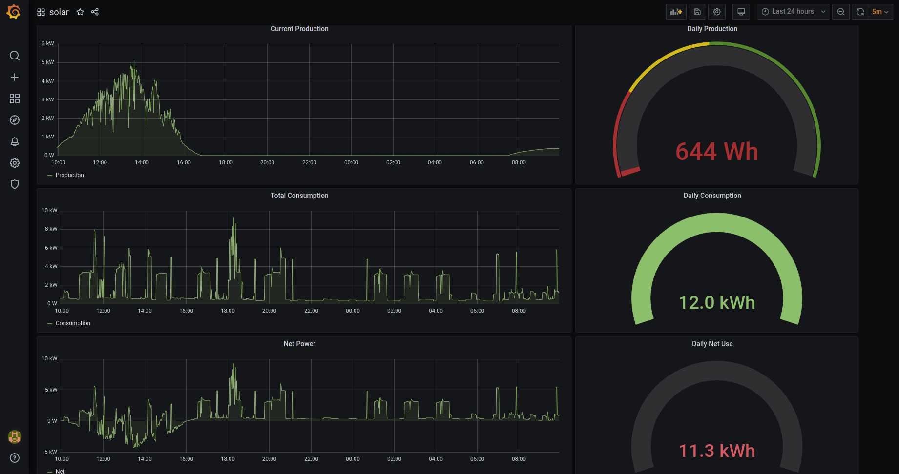

# enphase-envoy-monitoring
Influx and granfan stack for locally monitoring enphase solar.

Note: this is currently just rough notes, things may be using old versions, default passwords, and unsecure connections.  This should be updated
to enhance security especially if you want to run outside of a protected network.




## Requirements
You must first obtain two sets of credentials: the user/password for your envoy and the installer password.

The envoy username is always "envoy" and the password is the last six digits of your envoy serial number.  The serial number can be found by browsing to the IP of your envoy (or http://envoy.local) 

The installer password can be obtained by running the passwordCalc.py script after updaing it with your Envoys serial number. Credit to https://github.com/sarnau/EnphaseEnergy

## Build the images 
```
docker build -t envoy-python:latest .
docker build -t envoy-stream-python:latest -f Dockerfile-stream .
```

## Optionally test one locally
```
docker run -d -e "PYTHONUNBUFFERED=1" envoy-python:latest
```

## Start the compose stack
```
docker-compose up -d
```

## References
* https://thecomputerperson.wordpress.com/2016/08/28/reverse-engineering-the-enphase-installer-toolkit/
* https://thecomputerperson.wordpress.com/2016/08/03/enphase-envoy-s-data-scraping/
* https://github.com/sarnau/EnphaseEnergy

